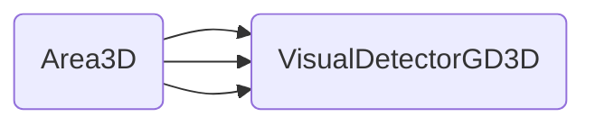
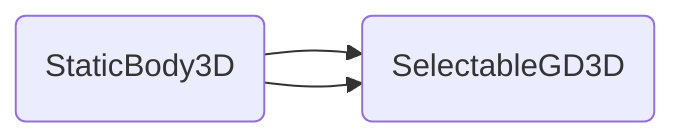
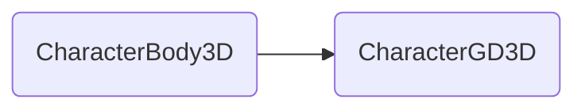

# GD3Dtopdown
Top down 3D controller for the Godot Game Engine using GDextension (Godot 4 beta 7.0, will update until release)  

This is a character controller that I'm using in a personal project. Decided to share it since It's using GDExtension and might be of use to someone should they get stuck.  

It also showcases a solution for top down 3D games where the camera can be rotated around the caharacter and buildings can be entered. Hiding walls and roofs and making them transparent to mouse raycasts.  

## Installation
### Compiled from source (Debug)  

This guide assumes you have the required C++ compilers and SCons installed, explained in the [godot compiling guide.](https://docs.godotengine.org/en/stable/development/compiling/index.html) 

Clone the project with submodules  
```
git clone --recurse-submodules git@github.com:jquinl/gd3dtopdown_project.git
```  
The source library is in `gd3d_example/addons/lib/gd3dtopdown/` here you can find the SConstruct file, which needs the godot-cpp submodule in the same folder `gd3d_example/addons/lib/gd3dtopdown/godot-cpp`  
```
cd gd3d_example/addons/lib/gd3dtopdown/
scons target=template_debug
```  
With this, the example project should work already.  
If your project has a different folder system:  

1. The binary will be placed in `gd3d_example/addons/bin`  

2. The needed `.gdextension` file can be found in `gd3d_example/addons/lib/gd3dtopdown.gdextension`  make sure you place it inside your folder and modify it to match the location of the binaries in your project.

3. Include a `.gdignore` file to avoid reloading the engine when new `.obj` files are generated.  

## Example
The example consists of 3 scenes, the main scene, the character scene and a building scene.

### Character scene (`res://scenes/GD3Dexample.tscn`)  
#### Description  
  
The scene root is a `CharacterGD3D` node. It has a collision shape, animator tree, animator and model children nodes, as well as a camera and two nodes used to detect building interiors and walls.
It also includes a gdscript example (`res://scripts/gd3topdown.gd`) with the movement function.

#### How it works  

The character can interact with other nodes, also implemented in this plugin.  

1. `SelectableGD3D`: When the mouse is over the object and aiming (Rigth click in the example).

2. `VisualObstacleGD3D`: When a `VisualDetectorGD3D` node enters the area this node will signal its children.  

3. `InteriorAreadGD3D`: When a `InteriorDetectordGD3D` node enters the area this node will signal its children.  

4. `TweenMeshInstanceGD3D`: When setup under a `VisualObstacleGD3D` node and receiving an entered signal this will perform a dissolve effect of the mesh, if shader parameters are set.

Remember to set the collision masks accordingly.

The character has a mask for collision detection, its used when aiming.  

Because of this, the `VisualObstacleGD3D` and `InteriorAreadGD3D` collision masks cannot be the same as the Character Aiming mask. However objects that can be detected and interacted with can be in both of those layers.  

### Building scene (`res://scenes/buildings/house.tscn`)  
#### Description  

This scene showcases how to order nodes in order to achieve a multy story building, and have the walls and roof of stories on top of the character dissapear without having to come between the camera and the character.  

#### How it works  
Here the nodes  `VisualObstacleGD3D` and `InteriorAreadGD3D` are used together in order to achieve the desired result. 

Two `InteriorAreadGD3D` nodes and several `VisualObstacleGD3D` are used in the scene.  
Any `VisualObstacleGD3D` node that is childed to a `InteriorAreadGD3D` will dissapear when that area is entered by a `InteriorDetectordGD3D`.  
A `VisualObstacleGD3D` can be childed to several `InteriorAreadGD3D` nodes. And will check wether the character changed to any of the areas it is childed to before dissapearing or reappearing, avoiding weird artifacts when two areas overlap.  

If the child `TweenMeshInstanceGD3D` of the visual obstacle has a shader material used for making the wall invisible, you can supply it with the parameters for the shader and the node will use two tweens to appear and dissapear the mesh (or any other effect you can think of) and will do so while keeping track of the progress of the effect.
Which will prevent pops.

An invisible mesh casting shadows overlaps the building, which allows the nodes to dissolve without having to cast shadows.

### Main scene (`res://scenes/main_scene.tscn`)

This is the main scene. It has a `VisualObstacleGD3D` node without parent (will only disspear when colliding with a `VisualDetectorGD3D`), the house, a `SelectableGD3D` and the character as well as green selectable box.

The `SelectableGD3D` will simply emit a signal when the mouse is aiming and hovers over it, stops hovering over it. Or is hovering over it and the aiming stops. (`res://scripts/selectable_node.gd`)

  

## Node structure  

  

  

Each node has a separate file in `gd3d_example/addons/lib/gd3dtopdown/src`. An additional file `helpers_gd3d.hpp` is used in order to centralize the values of the signals passed around internally, processed with the `_notification(int)` function.  

