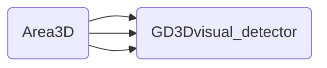
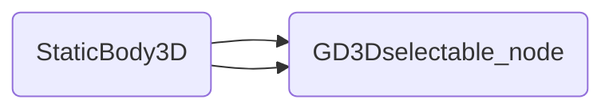
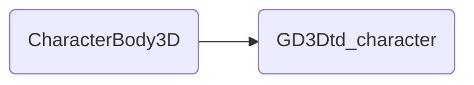

# GD3Dtopdown
Top down 3D controller for the Godot Game Engine using GDextension (Godot 4 beta 5.0, will update until release)  
(under construction and subject to change, use only in DEBUG mode)..

This is a character controller that I'm using in a personal project. Decided to share it since It's using GDExtension and might be of use to someone should they get stuck.  

It also showcases a solution for top down 3D games where the camera can be rotated around the caharacter and buildings can be entered. Hiding walls and roofs and making them transparent to mouse raycasts.  

## Installation
### Compiled from source (Debug)  

This guide assumes you have the required C++ compilers and SCons installed, explained in the [godot compiling guide.](https://docs.godotengine.org/en/stable/development/compiling/index.html) 

Clone the project with submodules  
```
git clone --recurse-submodules git@github.com:jquinl/gd3dtopdown_project.git
```  
The source library is in `gd3dtopdown_project/extensions/libgd3dtopdown/` here you can find the SConstruct file, which points to `gd3dtopdown_project/extensions/godot-cpp/SConstruct`  
```
cd gd3dtopdown_project/extensions/libgd3dtopdown/
scons target=template_debug
```  
The binary will be placed in the bin folder inside the example godot project `gd3dtopdown_project/gd3dtopdown_godot/bin`  

The needed `.gdextension` file can be found in `gd3dtopdown_project/gd3dtopdown_godot/ext/libgd3dtopdown.gdextension`  make sure you place it inside your folder and modify it to match the location of the binary in your project.

## Example
The example consists of 3 scenes, the main scene, the character scene and a building scene.

### Character scene (`res://scenes/GD3Dexample.tscn`)  
#### Description  
  
The scene root is a GD3Dtd_character node (`gd3dtopdown_project/extensions/libgd3dtopdown/src/GD3Dtd_character.hpp`)  

It has a collision shape, animator tree, animator and model children nodes, as well as a camera and two nodes used to detect building interiors and walls.
It also includes a gdscript example (`res://scripts/gd3topdown.gd`) with the movement function.

#### How it works  

The character can interact with 3 other nodes, also implemented in this plugin.  

1. GD3Dselectable_node: When the mouse is over the object and aiming (Rigth click in the example).

2. GD3Dvisual_obstacle: When the object is between the camera and the character this node will signal its children, interacts with GD3Dvisual_detector node.  

3. GD3Dinterior_area: When the character enters an area this node will signal its children, interacts with GD3Dinteriors_detector node.

3. GD3Dtween_mesh: When setup under a GD3Dvisual_obstacle this will signal the mesh to start a dissolve effect, if shader paramtetrs are set.

Remember to set the collision masks accordingly.

The character has a mask for collision detection, its used when aiming.  

Because of this, when selecting collision masks Visual and Interior Collision Masks cannot be the same as the Aiming mask. However objects that can be detected and interacted with can be in both of those layers.

### Building scene (`res://scenes/buildings/house.tscn`)  
#### Description  

This scene showcases how to order nodes in order to achieve a multy story building, and have the walls and roof of stories on top of the character dissapear without having to come between the camera and the character.  

#### How it works  
Here the nodes  `GD3Dvisual_obstacle` and `GD3Dinterior_area` are used together in order to achieve the desired result. 

Two `GD3Dinterior_area` nodes and several `GD3Dvisual_obstacle` are used in the scene.  
Any `GD3Dvisual_obstacle` node that is childed to a `GD3Dinterior_area` will dissapear when that area is entered.  
A `GD3Dvisual_obstacle` can be childed to several `GD3Dinterior_area` nodes. And will check wether the character changed to any of the areas it is childed to before dissapearing or reappearing, avoiding weird artifacts when two areas overlap.  

If the child `GD3Dtween_mesh` of the visual obstacle has a shader material used for making the wall invisible, you can supply it with the parameters for the shader and the node will use two tweens to appear and dissapear the mesh (or any other effect you can think of) and will do so while keeping track of the progress of the effect.
Which will prevent pops.

An invisible mesh casting shadows overlaps the building, which allows the nodes to dissolve without having to cast shadows.

### Main scene (`res://scenes/main_scene.tscn`)

This is the main scene. It has a `GD3Dvisual_obstacle` node without parent (will only disspear when it's between the camera and the character), the house, a `GD3Dselectable_node` and the character as well as green selectable box.

The `GD3Dselectable_node` will simply emit a signal when the mouse is aiming and hovers over it, stops hovering over it. Or is hovering over it and the aiming stops. (`res://scripts/selectable_node.gd`)

  

## Node structure  

  

  

An additional file `gd3dtopdown_project/extensions/libgd3dtopdown/src/GD3Dhelpers.hpp` is used in order to centralize the values of the signals passed around internally


